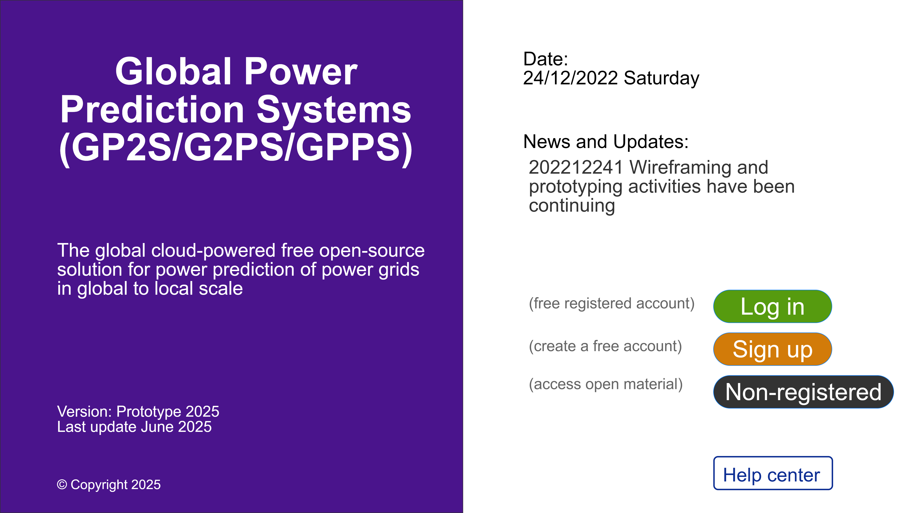

# Global Power Prediction Systems
Global Power Prediction Systems (GP2S/G2PS/GPPS) is an open science expert/event/data-driven, fact-based, worldwide real-time geographic information systems (GIS) based web and device application that runs on all devices like desktops, laptops, and smartphones to predict all items of power consumption and generation at almost any time horizon and interval units in any geographical, administrative and power grid decomposition units. 
# Academic Publications:
Please visit 
https://doi.org/10.30521/jes.1021838
https://doi.org/10.30521/jes.338575
https://globaljournals.org/GJRE_Volume17/3-Comparative-Study-on-Experimental.pdf
https://globaljournals.org/GJRE_Volume17/1-Comparative-Study-on-Experimental.pdf
https://doi.org/10.11648/j.ajasr.20170304.13
https://doi.org/10.11648/j.cssp.20170602.13
# Description:
# Table of Contents:
# Installation:
# Usage:
# Software Support:
# Contributing:
# Credits:
# License:
Open Science
